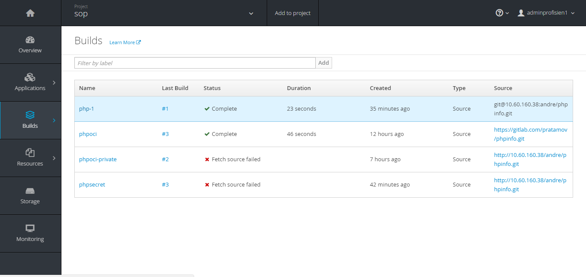
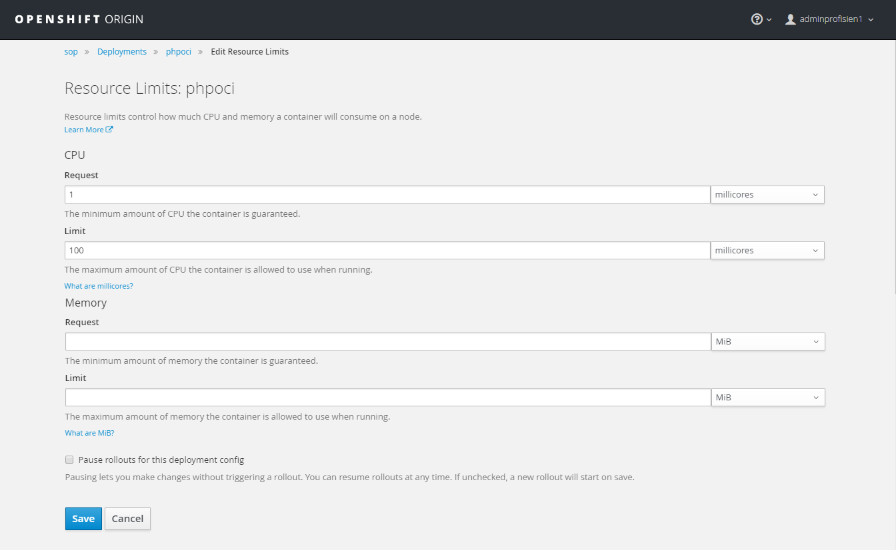
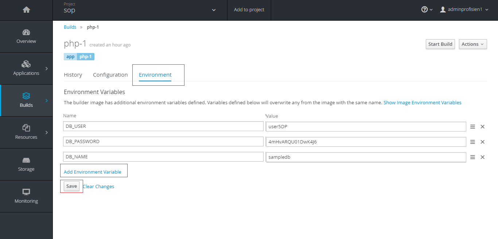

## Setting Source Secrets

**1. Create SSH keys**

see [Create SSH Keys in Linux](tutorial/#create-ssh-keys-in-linux)

**2. Click `Resources > Secret` in OpenShift web console**

**3. Click `Create Secret` button**

**4. Fill the required form**

* Select `Source Secret` in Secret Type
* Specify Secret Name
* Select `SSH Key` in Authentication Type
* Upload SSH Private Key file
* Click `Create`

## Configure Git WebHook

OpenShift allows the deployed application to automatically re-deploy when the source repository changed. To enable this feature, user have to configure Git WebHook. This guide using GitLab as Git repository. Assumed there is a running application in OpenShift to configure the WebHook.

**1. Click `Builds > Builds` in OpenShift web console **

**2. Select the application to add WebHook **

**3. In `Configuration` tab, copy the `Generic Webhook URL` **

**4. Open Web Hooks configuration in the Git project. Create WebHook with the `Generic Webhook URL` **

**5. Everytime user push the Git project, OpenShift will re-deploy the application accordingly**

## Configure Autoscaling

**1. Click `Applications > Deployments` from the web console**

**2. Select the application deployment to configure the autoscaling**

**3. Go to `Configuration` tab then click `Add Autoscaler`**

**4. Specify the minimum pods, maximum pods and percentage of CPU request target. Then click `Save`**

**5. Click `Edit Resource Requests and Limit` **

**6. Specify minimum and maximum CPU limit request **

**7. The pod is going to autoscaling accourdingly **

## Setting Environment Variables

**1. Click `Builds > Builds` in OpenShift web console **

**2. Select the application to set the environmet variables **

**3. Create the environment variables in the Environment tab **

## Setting Application Router (HTTP)

**1. Open OpenShift web console and select project**

**2. Click `Applications > Routes` **

**3. Click `Create Route` button **

**4. Fill the form**

* Enter `Hostname` with the format `[APPLICATION_NAME].apps.osh.telkom.co.id`
	
		example : myapplication.apps.osh.telkom.co.id

* Select the Service name
* Click Create

	

## Setting Application Router (HTTPS)

This section require SSL certificate. To generate self signed certificate in linux see [Create Self Signed SSL in Linux](tutorial/#create-self-signed-ssl-in-linux)

**1. Open OpenShift web console and select project**

**2. Click `Applications > Routes` **

**3. Click `Create Route` button **

**4. Fill the form**

* Enter `Hostname` with the format `[APPLICATION_NAME].apps.osh.telkom.co.id`
	
		example : myapplication.apps.osh.telkom.co.id

* Select the Service name
* Select the Certificate files (Certificate and Private Key).
* Click Create

	
