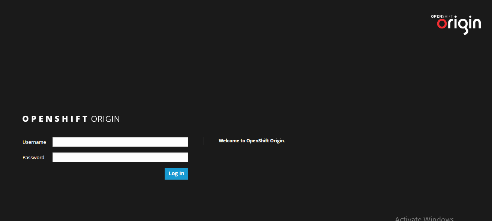

## Login to OpenShift Command Line Interface

[click here to download OpenShift CLI](https://github.com/openshift/origin/releases/tag/v1.5.1)

**1. Run login command `oc login [OPENSHIFT_URL]`**

**2. Entry the username and password**

	$ oc login https://lb.osh.telkom.co.id:8443
	Authentication required for https://lb.osh.telkom.co.id:8443 (openshift)
	Username: user001
	Password:
	Login successful.

## Login to OpenShift Web Console

**1. Open [OpenShift Web Console](https://lb.osh.telkom.co.id:8443) by web browser**

**2. Fill the username and password**

