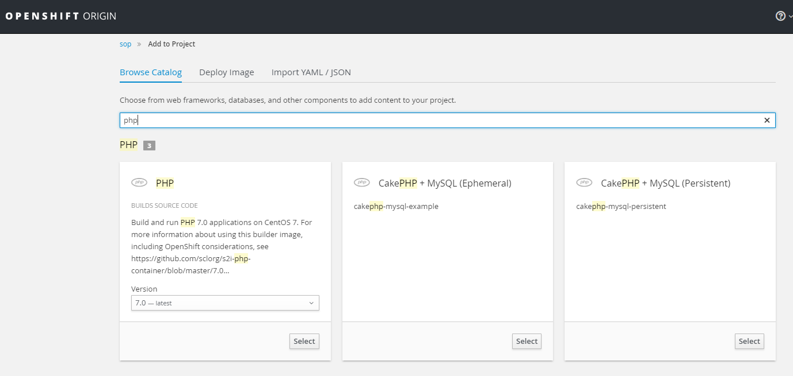

## Create New Project Using Web Console

**1. Open [OpenShift Web Console](https://lb.osh.telkom.co.id:8443)**

**2. Click `New Project` **

**3. Fill the form **

## Create New Project Using Command Line Interface

**1. Execute new-project command `oc new-project [PROJECT_NAME]`**

	$ oc new-project project0002
	Now using project "project0002" on server "https://lb.osh.telkom.co.id:8443".

	You can add applications to this project with the 'new-app' command. For example, try:

		oc new-app centos/ruby-22-centos7~https://github.com/openshift/ruby-ex.git

	to build a new example application in Ruby.
	
## Create New Application From Catalog

**1. Create New Application click `Add to Project` **

**2. Choose Application from the Catalog (tab `Browse Catalog`).**

	
**3. Fill the required form then click `Create` **

## Create New Application From Docker Image

**1. Prepare the application from [DockerHub Repositories](https://hub.docker.com/)**

**2. Create New Application (`Add to Project > Deploy Image`)**

**3. Specify the `Image Name` from chosen application from DockerHub Repositories**

**4. Fill the required form then click `Create`.**

## Create New Database

This section using MySQL database

**1. Create New Application click `Add to Project` **

**2. Choose MySQL Persistent from the Catalog**

**3. Fill the required form. Set unique `Database Service Name` do distinguish applications inside project. Leave `MySQL Connection Username`, `MySQL Connection Password` and `MySQL root user Password` empty to auto generate the values. Click `Create`**

**4. Save the generated `Username`, `Password`, `Database Name` and `Connection URL`. **

## Create New Application With Private Git Repository

This guide shows how to create new application which source in Git private repository. 

**1. Setting Source Secrets**

see [Setting Source Secrets](config/#setting-source-secrets)

**2. Add Public Key in Git Repository**

to show how to add public key in GitLab see [Add Public Key in GitLab Repository](tutorial/#add-public-key-in-gitlab-repository)

**3. Create New Application click `Add to Project` **

**4. Choose Application from the Catalog (tab `Browse Catalog`).**

	
**5. Fill the required form **

* Specify the application name

		example: php-1

* Fill `Git Repository URL` with the Git private project using SSH URL

		example: git@10.60.160.38:andre/phpinfo.git

* Click `advanced options`
* Select `Source Secret` with source secret created in Step 1
* Click `Create` button
