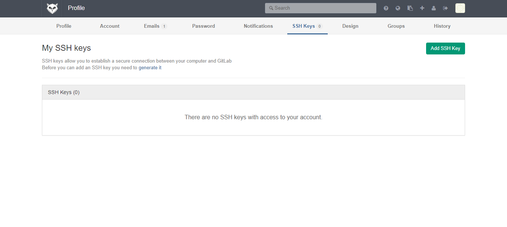
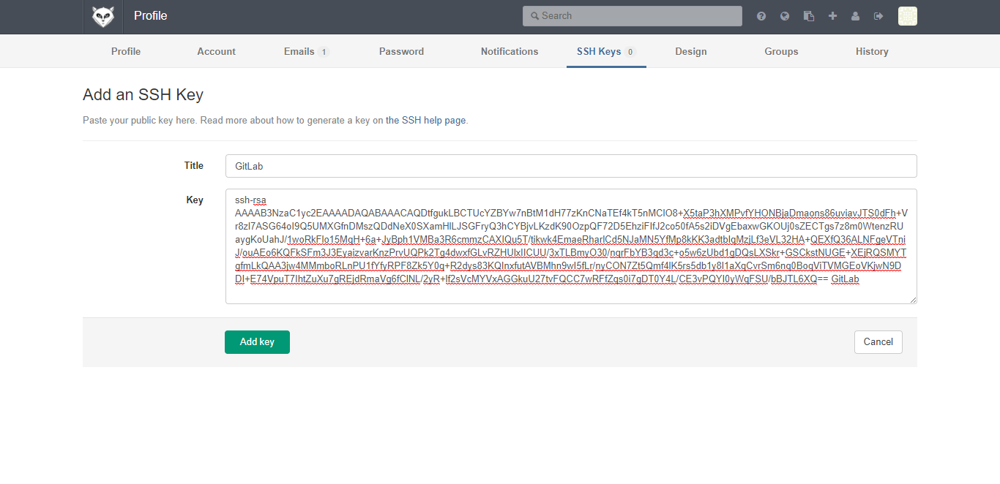
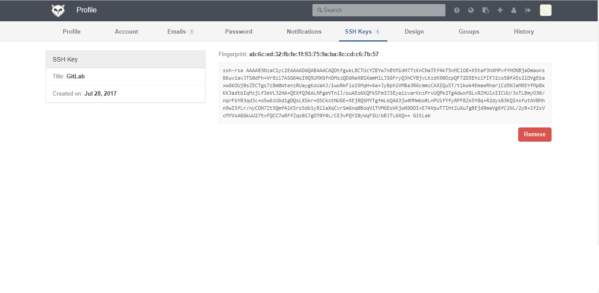
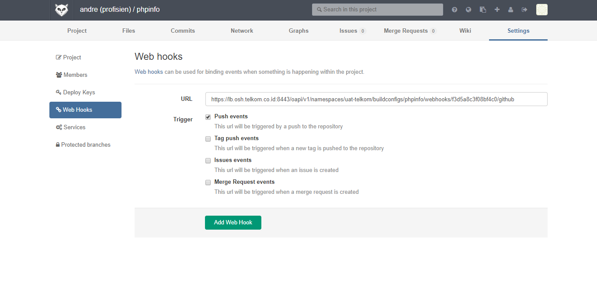

## Create SSH Keys in Linux
This tutorial shows how to generate SSH Keys in Linux Operating Systems. Generated a private key file (**$HOME/.ssh/id_rsa.pub**) and public key file (**$HOME/.ssh/id_rsa**).

**1. Run SSH keygen command `ssh-keygen -t rsa -C [SSH_KEY_TITLE] -b 4096`**

	$ ssh-keygen -t rsa -C "GitLab" -b 4096
	Generating public/private rsa key pair.
	Enter file in which to save the key (/root/.ssh/id_rsa):
	Enter passphrase (empty for no passphrase):
	Enter same passphrase again:
	Your identification has been saved in /root/.ssh/id_rsa.
	Your public key has been saved in /root/.ssh/id_rsa.pub.
	The key fingerprint is:
	ab:6c:ed:32:fb:fe:1f:93:75:9a:ba:8c:cd:c6:7b:57 GitLab
	The key's randomart image is:
	+--[ RSA 4096]----+
	|                 |
	|                 |
	|                 |
	|                 |
	|        S     . .|
	|         .   o +E|
	|       ..  .+ o .|
	|     .+..  =o+. .|
	|     .+B+.ooO+ . |
	+-----------------+

**2. Verify generated keys**

	$ cat $HOME/.ssh/id_rsa.pub
	ssh-rsa AAAAB3NzaC1yc2EAAAADAQABAAACAQDtfgukLBCTUcYZBYw7nBtM1dH77zKnCNaTEf4kT5nMClO8+X5taP3hXMPvfYHONBjaDmaons86uviavJTS0dFh+Vr8zl7ASG64oI9Q5UMXGfnDMszQDdNeX0SXamHlLJSGFryQ3hCYBjvLKzdK90OzpQF72D5EhziFIfJ2co50fA5s2iDVgEbaxwGKOUj0sZECTgs7z8m0WtenzRUaygKoUahJ/1woRkFlo15MqH+6a+JyBph1VMBa3R6cmmzCAXIQu5T/tikwk4EmaeRharlCd5NJaMN5YfMp8kKK3adtbIqMzjLf3eVL32HA+QEXfQ36ALNFgeVTniJ/ouAEo6KQFkSFm3J3EyaizvarKnzPrvUQPk2Tg4dwxfGLvRZHUlxIICUU/3xTLBmyO30/nqrFbYB3qd3c+o5w6zUbd1gDQsLXSkr+GSCkstNUGE+XEjRQSMYTgfmLkQAA3jw4MMmboRLnPU1fYfyRPF8Zk5Y0q+R2dys83KQInxfutAVBMhn9wI5fLr/nyCON7Zt5Qmf4lK5rs5db1y8l1aXqCvrSm6nq0BoqViTVMGEoVKjwN9DDI+E74VpuT7IhtZuXu7gREjdRmaVg6fClNL/2yR+lf2sVcMYVxAGGkuU27tvFQCC7wRFfZqs0i7gDT0Y4L/CE3vPQYI0yWqFSU/bBJTL6XQ== GitLab

## Add Public Key in GitLab Repository

**1. Login to GitLab**

**2. Open SSH Keys page GitLab in `[GITLAB_HOST]/profile/keys`. Click *Add SSH Key* **

**3. Fill title input. Fill Key textbox with generated SSH public key (`cat $HOME/.ssh/id_rsa.pub`).**

**4. Click *Add key* **

## Add WebHook in GitLab Project

**1. Open Web Hook page in selected project in `http://[GITLAB_HOST]/[GITLAB_USERNAME]/[GITLAB_PROJECT_NAME]/hooks` **

**2. Fill Web Hook URL. Check *Push events* selector**

**3. Click Add Web Hook**

## Set Maven project for OpenShift

Java web application have to be a maven project to be able to deploy in OpenShift. Below is OpenShift plugin included in pom.xml.

		...
		<profile>
			<id>openshift</id>
			<build>
				<plugins>
					<plugin>
						<artifactId>maven-war-plugin</artifactId>
						<configuration>
							<failOnMissingWebXml>false</failOnMissingWebXml>
							<outputDirectory>deployments</outputDirectory>
							<warName>ROOT</warName>
						</configuration>
					</plugin>
				</plugins>
			</build>
		</profile>
		...
	</project>

## Create Self Signed SSL in Linux

**1. Generate private key**
`openssl genrsa -out ca.key 2048`

	$ openssl genrsa -out ca.key 2048
	Generating RSA private key, 2048 bit long modulus
	............+++
	........+++
	e is 65537 (0x10001)

**2. Create CSR file. **
`openssl req -new -key ca.key -out ca.csr`

	$ openssl req -new -key ca.key -out ca.csr
	You are about to be asked to enter information that will be incorporated
	into your certificate request.
	What you are about to enter is what is called a Distinguished Name or a DN.
	There are quite a few fields but you can leave some blank
	For some fields there will be a default value,
	If you enter '.', the field will be left blank.
	-----
	Country Name (2 letter code) [XX]:ID
	State or Province Name (full name) []:
	Locality Name (eg, city) [Default City]:
	Organization Name (eg, company) [Default Company Ltd]:
	Organizational Unit Name (eg, section) []:
	Common Name (eg, your name or your server's hostname) []:
	Email Address []:

	Please enter the following 'extra' attributes
	to be sent with your certificate request
	A challenge password []:
	An optional company name []:
	$ openssl x509 -req -days 365 -in ca.csr -signkey ca.key -out ca.crt
	Signature ok
	subject=/C=ID/L=Default City/O=Default Company Ltd
	Getting Private key

This guide will generate `ca.crt`, `ca.csr` and `ca.key` files.

	$ ls
	ca.crt  ca.csr  ca.key

